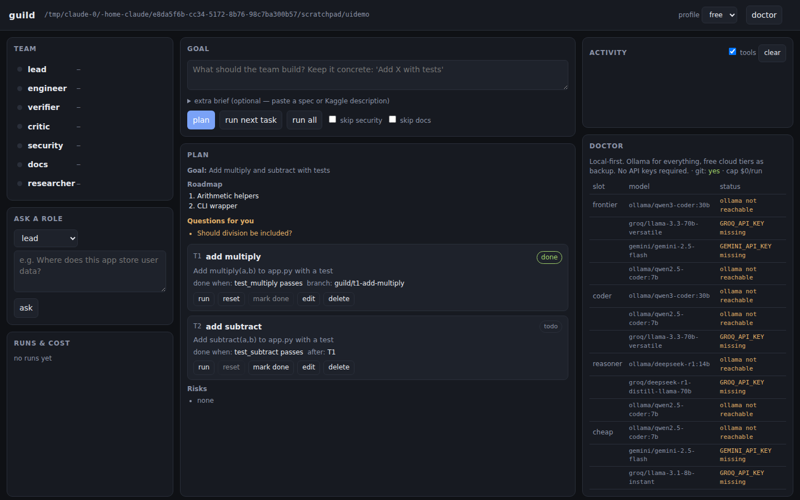

# guild

**A budget-aware AI engineering team for your codebase.**
A Lead plans, an Engineer implements on a branch, a Verifier runs your tests, a Critic and a
Security reviewer push back, the Lead signs off, and a Writer updates the docs.
Every seat is filled by whatever model your budget allows — local Ollama for £0, a
frontier model only where it earns its cost, or the best model everywhere.

```
you ──goal──▶ Lead ──tasks──▶ Engineer ──branch──▶ Verifier ──▶ Critic + Security ──▶ Lead ──▶ Docs
                ▲                  ▲                   │              │                  │
                └── replan ────────┴── revise (≤N) ────┴──────────────┘        you merge ◀┘
```

- **Three profiles, one config switch:** `free` (Ollama + free tiers, never spends), `lite`
  (~£10–20/month: Claude plans and reviews, local model codes, cheap APIs critique),
  `pro` (Fable leads, Opus codes, GPT critiques, Gemini documents).
- **Roles are YAML.** Prompt + model slot + tool permissions. Drop a file in `.guild/roles/`
  to add or override one. No code changes.
- **Fallback chains.** Every slot lists candidates in order; unreachable or unpaid ones are
  skipped. Escalates the Engineer to a stronger model after repeated failures.
- **Deterministic verification.** Tests are run by guild, not by a model, so a pass is a real pass.
- **Small-model friendly.** If a local model writes a tool call as text instead of using the protocol, guild executes it anyway.
- **Guardrails.** Tools are scoped to the project directory. Reviewers are read-only. The
  Writer can only touch Markdown. API keys are stripped from every subprocess. Nothing is
  merged to `main` by the tool — you review the branch.
- **Full JSONL trace** of every model call, tool call, decision and test run with token
  counts and provenance, plus `guild cost` to see where money went.
- **Any OpenAI-compatible endpoint** (Ollama, Groq, Gemini, DeepSeek, OpenRouter, Mistral,
  OmniRoute, LiteLLM, vLLM…) plus Anthropic natively.

MIT licensed. Python 3.10+.



## Quick start

```bash
pip install guild-ai            # or: pip install -e . from a clone

cd your-project
guild init . --profile free      # creates .guild/config.yaml
guild doctor                     # shows which models are reachable
guild plan "Add a REST endpoint that returns the top 10 users by score, with tests"
guild run                        # runs the next task: engineer → verify → review → docs
git diff main...guild/t1-...     # inspect the branch, then merge it yourself
```

### Free profile (no keys)

Install [Ollama](https://ollama.com) and pull a coder model:

```bash
ollama pull qwen2.5-coder:7b     # ~5 GB, fine on 16 GB RAM
ollama pull qwen3-coder:30b      # better, needs ~20 GB RAM (or a GPU)
ollama pull deepseek-r1:14b      # reasoning model for critique/security
```

Optional free cloud fallbacks: set `GROQ_API_KEY` and/or `GEMINI_API_KEY` (both have free
tiers). The free profile has a `$0` cap — it will refuse to use a paid model even if a key
is present.

### Lite profile (~£10–20/month)

```bash
export ANTHROPIC_API_KEY=...     # Lead + escalation
export DEEPSEEK_API_KEY=...      # Critic / Security (very cheap)
export GEMINI_API_KEY=...        # Docs (free tier is enough)
guild init . --profile lite
```

The Engineer still runs on Ollama. Claude is called for planning, for the final review of
each task, and for coding only after the local model fails verification twice. Each run is
capped at `$2` by default (`limits.max_usd_per_run` in the profile).

### Pro profile

```bash
export ANTHROPIC_API_KEY=... OPENAI_API_KEY=... GEMINI_API_KEY=...
guild init . --profile pro
```

## Dashboard

```bash
pip install "guild-ai[ui]"      # adds fastapi + uvicorn
cd your-project && guild ui     # opens http://127.0.0.1:7331
```

Everything the CLI does, in a browser tab: type a goal and press **plan**, edit or reorder
tasks, press **run**, and watch each agent light up as it works — every model call, tool call,
test result and review decision streams in live. The **doctor** panel shows which models are
ready; **runs & cost** shows what each run consumed. It binds to localhost only and runs in
the same process as the CLI, so there's nothing to deploy.

## Commands

| command | what it does |
|---|---|
| `guild init [path] --profile P` | create `.guild/` with config; adds `.guild/runs/` to `.gitignore` |
| `guild doctor` | check every model in the active profile: reachable / key set / not pulled |
| `guild plan "goal" [--context brief.md]` | Lead writes roadmap + tasks → `.guild/plan.json` |
| `guild status` | show the plan and task states |
| `guild run [T1 T3 ...] [--all] [-y] [--skip security,docs]` | implement task(s) through the full loop |
| `guild review [--ref main] [--security-only]` | Critic + Security on the current diff, nothing else |
| `guild ask ROLE "question"` | ask one role (e.g. `researcher`, `security`) about the project |
| `guild cost` | token + estimated cost table from saved traces |
| `guild roles` | list roles and profiles (built-in + project overrides) |
| `guild ui [--port 7331]` | local web dashboard |

`-p PROFILE` overrides the profile for one command. `-C DIR` runs against another project.

## Roles

| role | slot | tools | job |
|---|---|---|---|
| **lead** | frontier | read, search, tests | roadmap, task breakdown, accept/revise/replan, improvement suggestions |
| **engineer** | coder → coder_escalation | read/write/edit, shell, tests, git | implement one task on a branch with tests |
| **verifier** | — | — | not a model: guild runs your `test_command` (and `lint_command`) itself and reports exit code, counts and failures |
| **critic** | reasoner | read, search, diff | adversarial code review with severity-ranked findings |
| **security** | reasoner | read, search, diff, shell (read-only) | secrets, injection, deps, privacy, CI/supply-chain |
| **docs** | cheap | read, write (Markdown only) | README / CHANGELOG / docs after each accepted task |
| **researcher** | cheap | read, search, web | "how should we do X?" with trade-offs and sources |

Add your own: copy any `src/guild/data/roles/*.yaml` into `.guild/roles/`, edit the prompt,
slot and tools, and add its name to `roles_enabled` in `.guild/config.yaml`. Ideas: a
`performance` reviewer, a `ux` reviewer for front-end work, a `kaggle` role that reads the
competition brief and proposes a baseline.

## Profiles

A profile maps abstract **slots** to a fallback chain of concrete models:

```yaml
slots:
  frontier: [anthropic/claude-fable-5-1, anthropic/claude-sonnet-5, ollama/qwen3-coder:30b]
  coder:    [ollama/qwen3-coder:30b, ollama/qwen2.5-coder:7b, deepseek/deepseek-chat]
  reasoner: [deepseek/deepseek-reasoner, gemini/gemini-2.5-flash]
  cheap:    [gemini/gemini-2.5-flash, ollama/qwen2.5-coder:7b]
limits:
  max_revision_rounds: 3     # engineer ↔ reviewers loops per task
  escalate_after: 2          # failed rounds before using coder_escalation
  max_usd_per_run: 2.0       # hard stop
```

Model ids are `provider/model`. Providers: `ollama`, `anthropic`, `openai`, `groq`, `gemini`,
`deepseek`, `openrouter`, `mistral`, `omniroute`, `litellm`, `custom` (set
`CUSTOM_OPENAI_BASE_URL`). Copy a profile into `.guild/profiles/` to customise it.

Prices used for estimates live in `src/guild/providers/router.py` (`DEFAULT_PRICES`);
local models cost 0. They are list-price approximations — check your provider's dashboard
for the real bill.

## Configuration (`.guild/config.yaml`)

```yaml
profile: lite
test_command: python -m pytest -q
lint_command: ruff check .          # optional; verifier runs it if set
sandbox: local                      # or docker (project bind-mounted, no network)
docker_image: python:3.11-slim
roles_enabled: [lead, engineer, verifier, critic, security, docs]
ignore: [.git, .guild, node_modules, .venv, __pycache__, dist, build]
```

## Traces

Each run writes `.guild/runs/<run-id>/trace.jsonl`. One JSON object per line:

```json
{"seq": 7, "ts": 1758375000.1, "run_id": "…", "kind": "model_call", "role": "engineer",
 "slot": "coder", "model": "ollama/qwen3-coder:30b", "input_tokens": 3120, "output_tokens": 410,
 "usd": 0.0, "latency_s": 8.2, "n_tool_calls": 2, "stop_reason": "tool_calls", "content_preview": "…"}
```

Kinds: `run_start`, `phase`, `model_call`, `tool_call`, `fallback`, `verification`,
`decision`, `task_end`, `run_end`. Load with `pandas.read_json(path, lines=True)`.
Traces may contain code excerpts, so `guild init` git-ignores them.

## Using it for a Kaggle competition

```bash
guild init . --profile lite
guild plan "Build a baseline for this competition, a CV pipeline and a submission script" \
           --context competition_brief.md
guild ask researcher "What approaches won similar tabular competitions recently?"
guild run --all
```

## Safety model

- All file tools resolve inside the project root; `../` escapes are refused.
- Critic, Security and Verifier are read-only. Docs can only write `*.md`.
- Subprocesses run with `*KEY*`, `*TOKEN*`, `*SECRET*`, `*PASSWORD*` env vars removed.
- `sandbox: docker` runs commands in a throwaway container with no network.
- guild creates and commits to `guild/<task>` branches only when the tree is clean; it never
  merges, pushes, or touches `main`.
- The `free` profile refuses any model with a non-zero price. Every profile has a per-run cap.

This is still an LLM writing code: read the diff before you merge.

## Development

```bash
git clone https://github.com/<you>/guild && cd guild
pip install -e ".[dev]"
pytest              # 16 tests, no API needed (scripted fake provider)
```

Layout:

```
src/guild/
  cli.py            typer commands
  ui/server.py      FastAPI dashboard (guild ui) + SSE event hub
  ui/index.html     the dashboard page (no build step)
  workflow.py       Guild: plan / run_task / ask
  agent.py          one role's tool-calling loop
  config.py         Profile / Role / ProjectConfig loading
  trace.py          JSONL trace
  sandbox.py        local + docker command runners
  tools/registry.py file, search, shell, git, web tools
  providers/        openai_compat, anthropic, router (fallback + cost)
  data/roles/       built-in role YAMLs
  data/profiles/    free / lite / pro
```

## Roadmap

- [ ] `guild watch` — re-run Critic/Security on every commit
- [ ] parallel engineers on independent tasks
- [ ] streaming output
- [ ] VS Code extension
- [ ] trace viewer inside the dashboard
- [ ] more built-in roles (performance, ux, data-quality)

## License

MIT — see [LICENSE](LICENSE).
